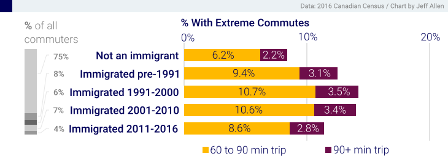

# Who Are Canada's Extreme Commuters?

There is conventional wisdom, as well as extensive academic [research](https://doi.org/10.1080/01441647.2019.1649317), that spending a long time commuting to work is undesirable.

In 2016, **9.7%** of commuters in Canada were **extreme commuters**, defined by having a one-way commute greater than or equal to 60 minutes.

However, in our analysis of 2016 census data, we find that there are stark differences in extreme commuting among different population groups in Canada.

- These charts are are based on the full 25% sample of the 2016 Canadian census. This includes records of over 4.5 million Canadians who reported commuting to a usual place of work.

- All data presented above are self-reported from the census except for Low-Income status which is based on the after-tax [Low-Income Cutoff](https://www12.statcan.gc.ca/census-recensement/2016/ref/dict/fam019-eng.cfm), derived from linked data from the Canada Revenue Agency

- The data were accessed at the Toronto Research Data Centre (RDC), operated by Statistics Canada. Only aggregated statistics, like those shown above, were released from the RDC. This data can be downloaded from [here](https://github.com/jamaps/extreme-commute-canada/tree/main/data-2016).

- We've also used this data to compute logistic regression models predicting the likelihood of being an extreme commuter. We found that these inequities persist, even after controlling for occupation, geography, job accessibility, and mode choice among other variables. We will be releasing the results of this analysis shortly.

- Lastly, our analysis was based on 2016 census data, back when most workers travelled to work 5 days a week. Clearly this has shifted during COVID-19. Continuing this analysis using data from 2020 onward should also look at weekly commute frequency if possible.

