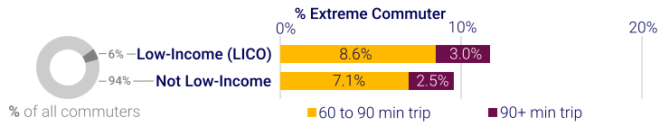
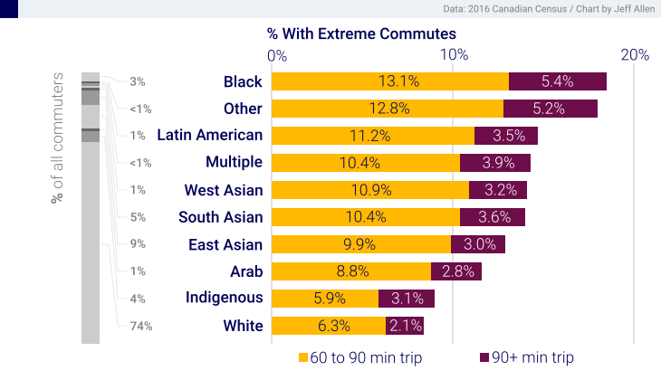
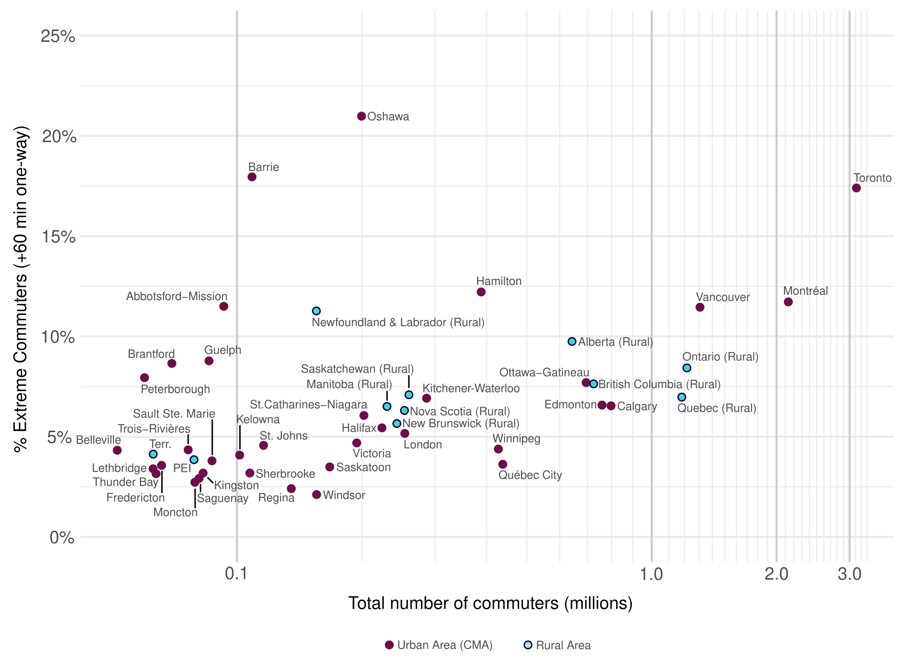

# Inequalities of Extreme Commuting

How are different socio-economic groups using the dissaggregated 

with Black commuters, over 18% having commutes in excess of 60 minutes, compared to less than 9% of White commuters. All other groups are 

There

One may think, into logistic regression models the effects still hold.

## Notes

The full sample of the long-form 2016 Canadian census was accessed at the Toronto Research Data Centre (RDC), which is operated by Statistics Canada. All analysis was run in R. Only re-aggregeted statistics, like those shown above, were released from the RDC.